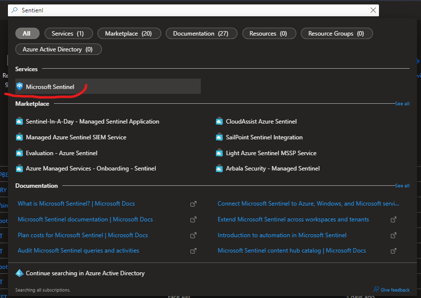
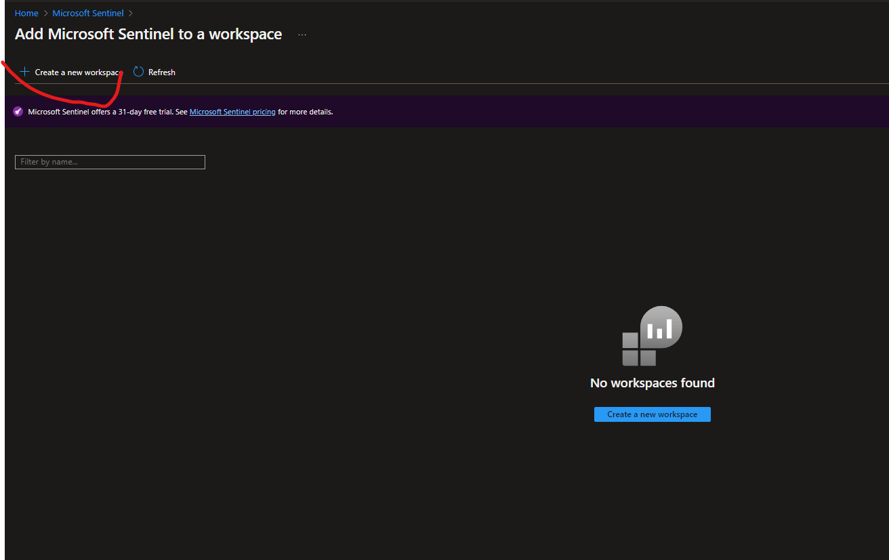
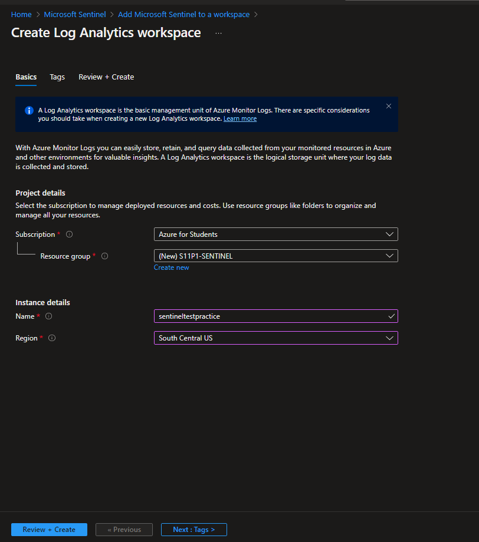
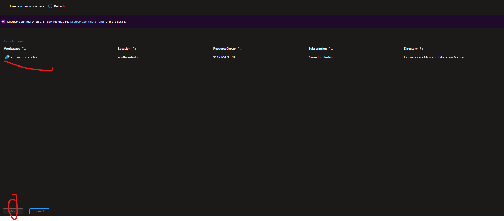
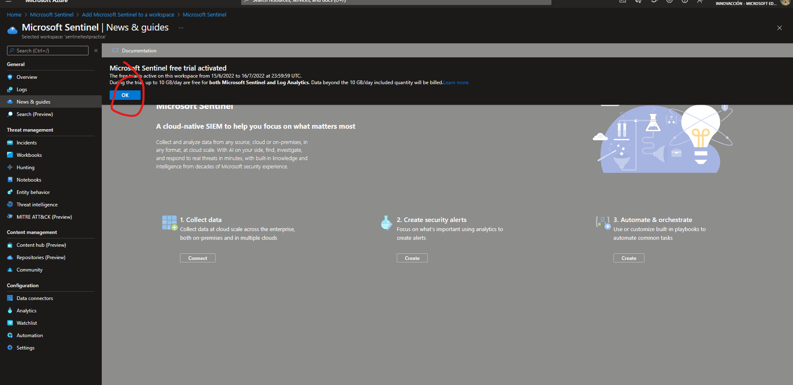
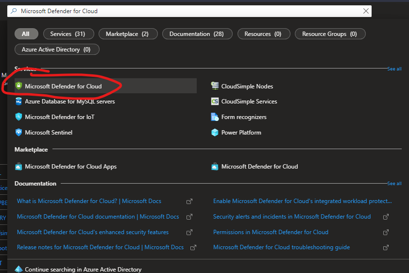
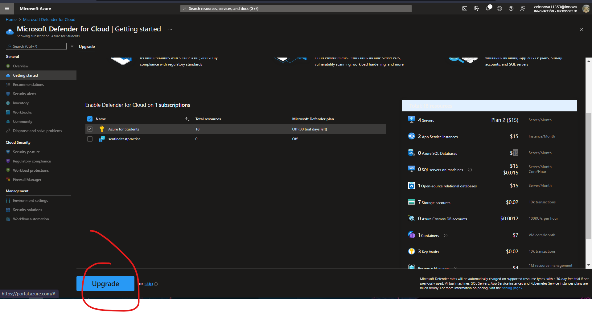

# AZURE - SENTINEL
**En esta practica aprenderas a crear el recurso de Microsoft Sentinel**

## Requisitos
- Tener una suscripcion en Azure
- Tener una conexion a internet
- Tener un navegador instalado (Brave,Google,Firefox, etc)
-------------------------

## TUTORIAL

**1.-Nos vamos al portal de azure y buscamos "Microsoft Sentinel"**

**2.-Creamos un espacio de trabajo**

**3.-Le damos lo minimo para crear un recurso (le damos en revisar y en crear y nos vamos al recurso)**

**4.-Una vez aqui le daremos al nombre que le hayamos puesto y en Add**

**5.-Como podras ver tenemos la Version Trial le damos en "OK"**

**6.-Si queremos usar la version completa, buscamos Microsoft Defender For Cloud**

**7.-Y en la suscripcion que tenemos la upgradeamos**

